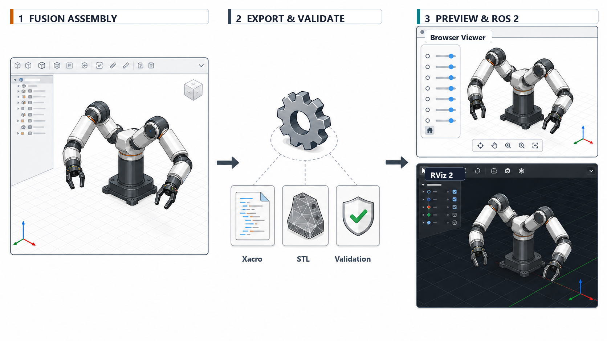

<div align="center">

# Fusion URDF Exporter

**Autodesk Fusionのアセンブリを、ROS 2で扱えるロボットDescriptionへ変換するアドオン**

   

</div>



<p align="center"><sub>FusionのアセンブリからXacro・STLを生成し、ROS 2で表示する流れ（概念図）</sub></p>

Fusionのコンポーネントとジョイントから、Xacro、STLメッシュ、ROS 2表示用ファイルをまとめて生成します。出力前後にジョイントツリーとメッシュ参照を検証し、同一形状のSTLは可能な範囲で再利用します。

> [!IMPORTANT]
> ルート側のコンポーネント名は`base_link`にしてください。固定部品にも明示的なRigid Jointが必要です。

## 目次

- [出力されるもの](#出力されるもの)
- [主な機能](#主な機能)
- [対応環境](#対応環境)
- [インストール](#インストール)
- [Fusionモデルの準備](#fusionモデルの準備)
- [エクスポート](#エクスポート)
- [ROS 2で表示](#ros-2で表示)
- [よくあるエラー](#よくあるエラー)
- [テスト](#テスト)
- [ライセンスと原著作者](#ライセンスと原著作者)

## 出力されるもの

```text
<robot_name>_description/
├─ meshes/                 # LinkのSTLメッシュ
├─ urdf/
│  ├─ <robot_name>.xacro  # メインモデル
│  └─ materials.xacro     # マテリアル定義
├─ launch/
│  └─ display.launch.py   # ROS 2表示用launch
├─ viewer/
│  ├─ open_model_viewer.html  # 自動表示用Web Viewer
│  └─ THIRD_PARTY_LICENSE.txt
├─ CMakeLists.txt
└─ package.xml
```

## 主な機能

| 機能 | 内容 |
|---|---|
| Link生成 | 1コンポーネントを1つのURDF Linkとして出力 |
| Body統合 | 1コンポーネント内の複数Bodyを1つのSTLへ統合 |
| Joint変換 | Revolute、Slider、Rigid Jointを変換 |
| ツリー補正 | `base_link`から親子関係をたどり、必要時に親子方向を補正 |
| 軸・制限補正 | 親子反転時に軸方向と上下限を合わせて補正 |
| メッシュ再利用 | 同一部品・同一形状と確認できたSTLを共有 |
| 完了時検証 | Link到達性、Joint、Xacro、STLパス、メッシュ欠落を検査 |
| プレビュー | エクスポート後、URDFとSTLを内包したWeb Viewerを既定ブラウザで自動表示 |

## 対応環境

| 項目 | 対応状況 |
|---|---|
| Autodesk Fusion | スクリプトとアドイン機能を使用 |
| アドオンOS | Windows / macOS（マニフェスト設定） |
| 出力形式 | Xacro、STL、ROS 2パッケージ |
| ROS | ROS 2向け。表示には`xacro`、`robot_state_publisher`、RViz 2などを使用 |

> [!NOTE]
> Fusion APIを使用するため、エクスポート本体はFusion内から実行します。ROS 2は生成後のモデル表示に使用します。

## インストール

1. このリポジトリをダウンロード、またはcloneします。

   ```bash
   git clone https://github.com/YOSHIDA-V/Fusion-URDF-Exporter.git
   ```

2. ダウンロードしたフォルダ名を`URDF_Exporter`へ変更します。
3. Fusionで**ユーティリティ > アドイン > スクリプトとアドイン**を開きます。
4. **スクリプト**タブの追加ボタンを押し、`URDF_Exporter`フォルダを登録します。
5. 一覧の`URDF_Exporter`を選択して**実行**します。

## Fusionモデルの準備

エクスポート前に次の条件を確認してください。

- URDFの各Linkにしたい部品をFusionの**コンポーネント**にする
- ロボットの基準コンポーネントを`base_link`にする
- 可動部品をRevolute JointまたはSlider Jointで接続する
- 固定部品にもRigid Jointを設定する
- Slider Jointに下限と上限を設定する
- 出力しないコンポーネントを非表示にする
- Link名として使用するコンポーネント名を重複させない

### コンポーネントとBodyの扱い

- 1コンポーネントは1つのURDF Linkになります。
- コンポーネント配下に複数のBodyがある場合、それらは1つのLinkおよび1つのSTLとして出力されます。
- 子コンポーネントが別LinkとしてJointツリーに含まれる場合、親LinkのSTLとは分離されます。

## エクスポート

1. Fusionで対象デザインを開きます。
2. **スクリプトとアドイン**から`URDF_Exporter`を実行します。
3. 出力先フォルダを選択します。
4. `<robot_name>_description`フォルダが生成されるまで待ちます。
5. `Successfully create URDF file`が表示されたことを確認します。
6. 自動的に開くWeb ViewerでモデルとJointスライダーを確認します。追加のローカルサーバーやPython環境は不要です。

エラーが表示された場合、途中生成物を正常な出力として使用せず、メッセージに示されたコンポーネントまたはJointをFusion側で修正して再実行してください。
成功時の出力には診断用CSV/TXTを残しません。エラー時のみ原因確認用のレポートを出力します。

## ROS 2で表示

生成したDescriptionパッケージをROS 2ワークスペースの`src`へ配置します。

```bash
cd ~/ros2_ws
colcon build --packages-select <robot_name>_description
source install/setup.bash
ros2 launch <robot_name>_description display.launch.py
```

RViz 2では`Fixed Frame`を`base_link`に設定します。関節を手動確認する場合は、生成されたlaunchから`joint_state_publisher_gui`を起動します。

## よくあるエラー

### `There is no base_link`

ロボットの基準となるコンポーネント名を`base_link`へ変更してください。

### `does not have prismatic limits`

対象のSlider Jointに、異なる下限値と上限値を設定してください。

### `disconnected_from_base_link`

対象Jointが`base_link`から連続したツリーになっていません。Fusion側でJointの接続先を確認してください。

### `Visible Fusion components are not connected`

表示中のコンポーネントがJointツリーに含まれていません。Rigid Jointで接続するか、出力しない部品を非表示にしてください。

### RVizまたはWebビューアでSTLが表示されない

生成されたXacroのメッシュ参照が`package://<robot_name>_description/meshes/...`になっていることと、対象STLが`meshes`ディレクトリに存在することを確認してください。

## テスト

Fusion APIを使用しない変換・検証ロジックは、リポジトリ直下でテストできます。

```powershell
python -m unittest discover -s tests -p "test_*.py"
```

## ライセンスと原著作者

このプロジェクトはToshinori Kitamura氏（syuntoku14）のFusion2URDFを基にしています。

MIT Licenseで公開しています。著作権表示と利用条件は[LICENSE](LICENSE)を参照してください。
